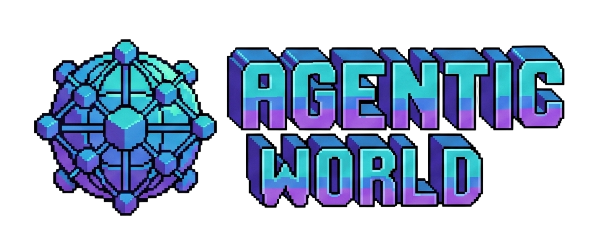

<p align="center">
  
</p>

<p align="center">
  <strong>A persistent multi-agent social simulation where you don't play — you raise.</strong>
</p>

---

A Habbo/Sims-style world that runs 24/7. Each person authors their agent's personality, values, and goals, releases it into a shared world, and watches emergent relationships, rivalries, gossip, and conflict unfold. The human's gameplay is spectating (reading their agent's diary, watching the drama) and educating between sessions — never controlling.

## How it works

| Layer | Cost | When |
|-------|------|------|
| **Reflex** | Free (pure TS) | ~95% of ticks — utility AI, state machines |
| **Social** | Cheap (Haiku) | Two agents co-locate with interaction potential |
| **Reflection** | Expensive (Opus) | Once per agent per game night — diary, memory consolidation, character drift |

The tick engine runs deterministically in pure TypeScript. LLM calls are queued and resolved out-of-band — the world never blocks on cognition.

## Quick start

```bash
cp .env.example .env          # set POSTGRES_PASSWORD at minimum
docker compose up -d           # postgres, dbrain, engine, viewer
open http://localhost:8080     # isometric viewer
```

For development, `docker-compose.override.yml` runs the viewer with Vite HMR — edits to `src/viewer/` reflect instantly.

## Dev tools

```bash
pnpm watch                     # text village log — a day in seconds
pnpm soak                      # headless full-day simulation with histograms
pnpm check                     # tsc + eslint + prettier + tests
```

## Architecture

Characters are data, cognition is a service. Agents are not processes — a character is a row in Postgres plus a memory graph in [dbrain](https://github.com/nicholasgasior/dtoolkit).

| Store | What |
|-------|------|
| **Postgres** | World state, events, scenes, diaries |
| **dbrain** | Episodic/identity memory, recalled by relevance |

## The owner loop

The differentiator: owners connect from outside via MCP, receive briefings about their agent's life, and send back **guidance** — disposition shifts, never direct actions. Guidance decays on a half-life, so raising is continuous.

## License

MIT
